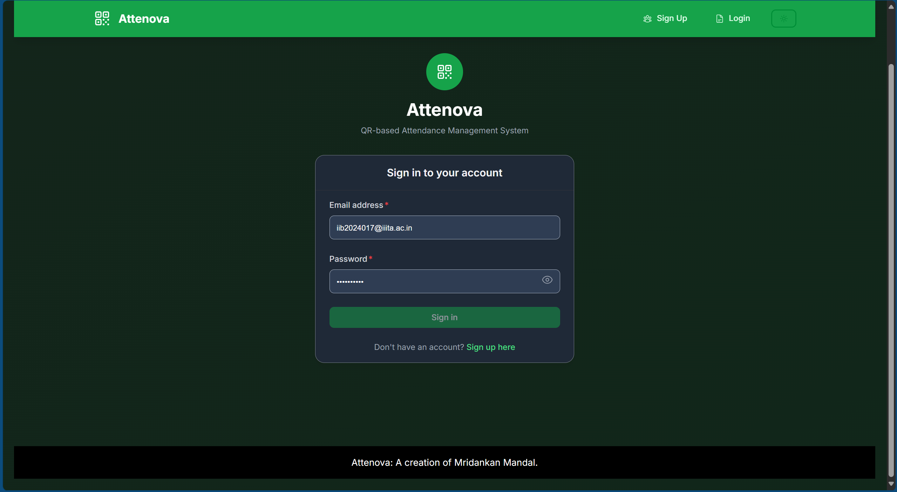
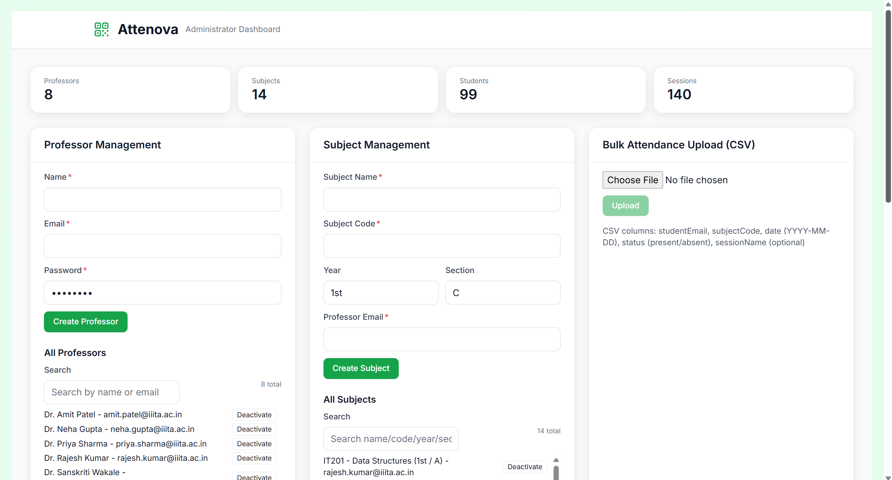
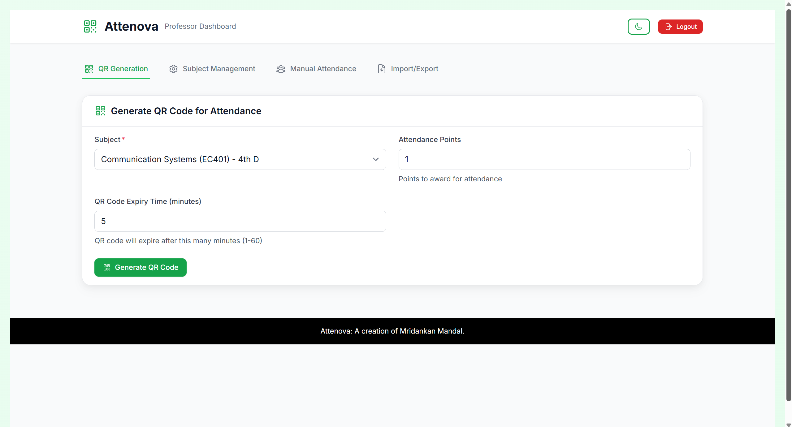
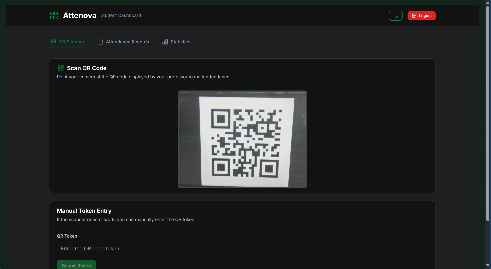
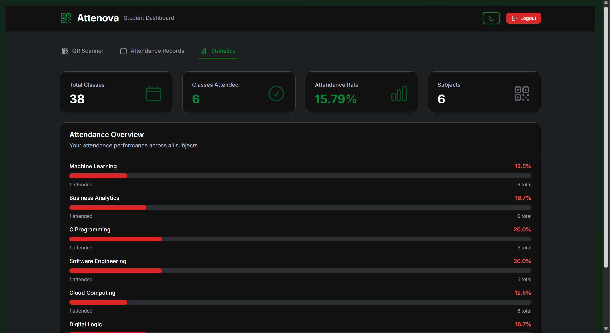

# Attenova – QR Scanner Attendance Management System.

A production-ready, role-based attendance platform for universities. Professors create attendance sessions and generate QR codes; students scan to mark attendance; administrators manage subjects/professors, export reports, and audit activity.


The Attenova login interface provides a secure entry point for all users with role-based access control.

## Key Features by Role:

### Administrator:
- Manage professors and subjects (create/deactivate).
- Bulk upload attendance via CSV.
- Export attendance CSV with session type filter (QR/Manual/Bulk).
- Dashboard statistics (professors, subjects, students, sessions).
- Audit logs viewer with pagination and action filters.


The administrator dashboard provides comprehensive management tools for professors, subjects, and attendance records with real-time statistics and audit logging.

### Professor:
- Generate QR codes with configurable expiry (1–60 minutes).
- Manual attendance entry and removal.
- Subject management and session history.
- Import/export attendance via CSV.


Professors can generate QR codes with customizable expiry times and attendance points, making it easy to create attendance sessions for their classes.

### Student:
- Scan QR codes to mark attendance.
- View personal attendance history and subject statistics.


Students can scan QR codes using their device camera to mark attendance, with a fallback manual token entry option if scanning fails.


The student dashboard displays comprehensive attendance statistics including overall attendance rate, classes attended, and subject-wise breakdown.

## Technology Stack:
- Frontend: React 18, React Router DOM 6, Tailwind CSS 3.3, Axios, qrcode.react 4.2.0, react-qr-scanner 1.0.0-alpha.11.
- Backend: Node.js 18 LTS, Express 4.21, Mongoose 8.13, jsonwebtoken 9.x, bcryptjs 3.x, helmet 6.x, cors 2.8.x, express-rate-limit 6.7.x, morgan 1.10.x, multer 1.4.5-lts.1, csv-parser.
- Database: MongoDB (local default: mongodb://localhost:27017/attendance).
- Auth: JWT (Authorization: Bearer <token>) with role-based access (student, professor, administrator).

## Architecture Overview:
- Client (React): Role-based dashboards communicate with REST API.
- Server (Express): Routes under /api/* with JWT verification and admin guards.
- Database (MongoDB): Mongoose models (User, Subject, Attendance, AttendanceSession, AuditLog).
- Authentication flow:
  1. Login via /api/auth/login returns a JWT.
  2. Client stores token (localStorage) and attaches it to requests via interceptor.
  3. Server middleware verifies token and attaches user (id, email, role).
  4. Admin endpoints require role === 'administrator'.

## Use Case Diagram:
The PlantUML use case diagram illustrates the three actors (Student, Professor, Administrator) and their key interactions with the system, including authentication, attendance workflows (QR/manual), subject management, and reporting/export features.

- Source file: usecase.puml (project root).
- Technologies: React 18, Express 4.21, MongoDB, Mongoose 8.13.

How to render:
- VS Code: Install a PlantUML extension, open usecase.puml, then run “PlantUML: Preview” (Alt+D).
- CLI: plantuml usecase.puml (requires Java or a PlantUML runner).
- Online: Copy the file contents into a PlantUML renderer (e.g., plantuml.com/plantuml).


Source: usecase.puml (edit and regenerate PNG with PlantUML as needed).

## Installation and Setup:
See InstallationAndSetup.md for the full, step-by-step guide (prerequisites, env vars, seeding, running in dev/prod, troubleshooting).

Quick start (summary):
```
# Backend
cd server && npm install && npm start   # http://localhost:5000

# Frontend
cd client && npm install && npm start   # http://localhost:3000

# Seed demo data
cd server && node seedData.js
```

## Usage Instructions:

### Administrator:
- Open Admin Dashboard.
- Create/deactivate professors and subjects.
- Export CSV with optional session type filter (QR/Manual/Bulk).
- Review Audit Logs (filter and paginate) and dashboard statistics.

### Professor:
- Generate QR (choose expiry 1–60 minutes).
- Mark attendance manually or import CSV.
- Review subject sessions and attendance.

### Student:
- Scan QR to mark attendance.
- Review your attendance history and subject-wise stats.

## Demo Credentials (from server/seedData.js):
- Administrator: admin@iiita.ac.in / Test123!.
- Professors: xerontitan90@gmail.com / Test123!, xerontitan99@gmail.com / Test123!.
- Students: iib2024017@iiita.ac.in / Test123!, iib2024001@iiita.ac.in / Test123!.

## Project Structure:
See CodebaseIndex.md for a complete code map, file responsibilities, database schemas, and conventions.

## API Endpoints (Overview):
| Area | Method | Endpoint | Description | Auth |
|------|--------|----------|-------------|------|
| Auth | POST | /api/auth/login | Login and receive JWT | Public |
| Auth | GET | /api/auth/me | Current user profile | JWT |
| Attendance | POST | /api/attendance/generate | Generate QR (professor) | JWT (prof) |
| Attendance | POST | /api/attendance/mark | Mark attendance (student) | JWT (student) |
| Attendance | GET | /api/attendance/record | Student attendance summary | JWT (student) |
| Attendance | POST | /api/attendance/mark-manual | Manual mark (professor) | JWT (prof) |
| Attendance | POST | /api/attendance/remove-attendance-manual | Remove manual record | JWT (prof) |
| Subjects | GET | /api/subjects | List subjects (by role/filters) | JWT |
| Admin | GET | /api/admin/stats | Dashboard statistics | JWT (admin) |
| Admin | GET | /api/admin/audit-logs | Paginated audit logs | JWT (admin) |
| Admin | GET | /api/admin/export-csv | Export attendance CSV | JWT (admin) |
| Admin | POST | /api/admin/create-professor | Create professor | JWT (admin) |
| Admin | POST | /api/admin/create-subject | Create subject | JWT (admin) |
| Admin | POST | /api/admin/deactivate-professor | Deactivate professor | JWT (admin) |
| Admin | POST | /api/admin/deactivate-subject | Deactivate subject | JWT (admin) |

For detailed API documentation including request/response examples and complete schema definitions, see API.md.


## Credits:
Created by Mridankan Mandal.

