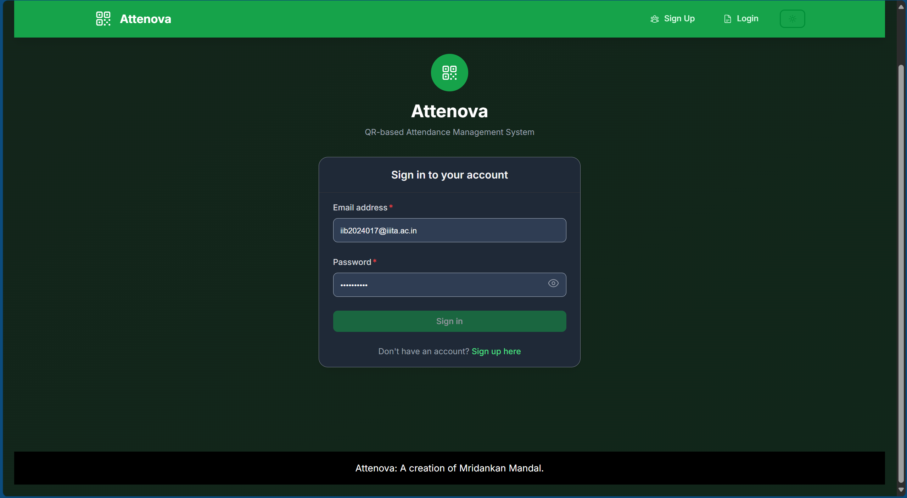
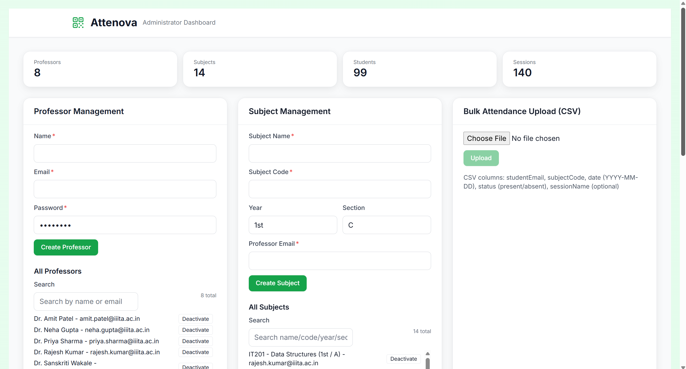
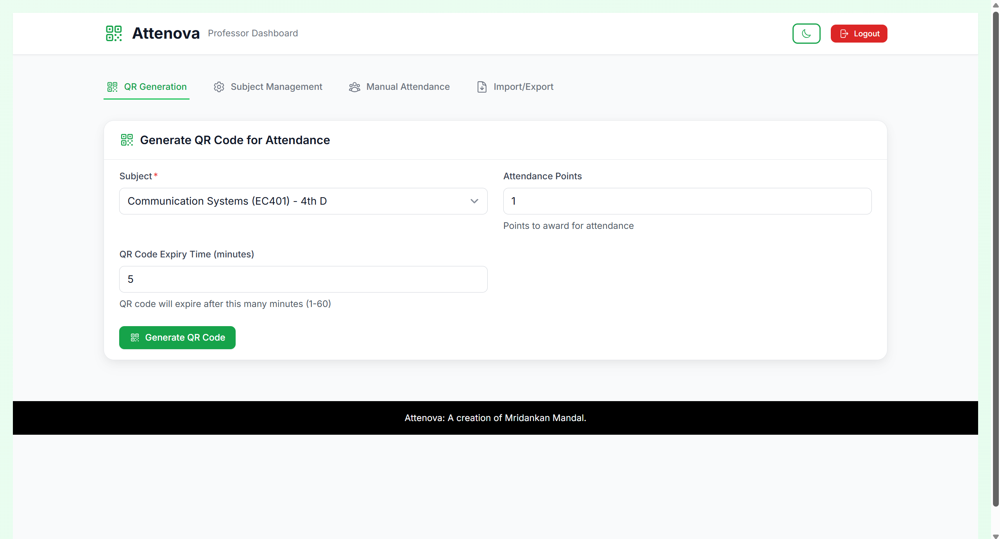
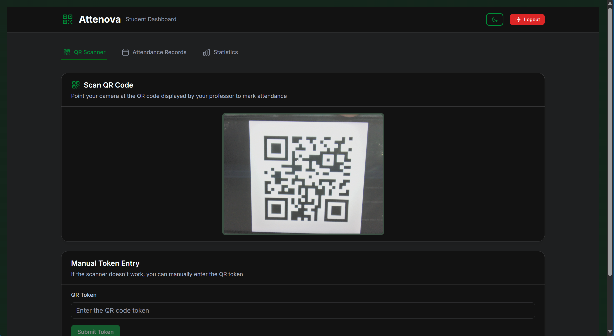

# Usage Guide – Attenova QR Scanner Attendance System.

This guide provides step-by-step instructions for each user role to effectively use the Attenova system.

## Authentication

### Login Page:

The login page is the entry point to the Attenova system where users enter their email and password to access their role-specific dashboards.

### Sign Up Pages:

The first page of the sign-up process allows new users to enter their basic information including name, email, and password.

The second page of the sign-up process collects additional information such as role selection and other required details for account creation.

The sign-up interface is fully responsive and works seamlessly on mobile devices for users registering on the go.

## Demo Accounts:

Before starting, use these credentials to log in (from `server/seedData.js`):

| Role | Email | Password |
|------|-------|----------|
| Administrator | admin@iiita.ac.in | Test123! |
| Professor | xerontitan90@gmail.com | Test123! |
| Professor | xerontitan99@gmail.com | Test123! |
| Student | iib2024017@iiita.ac.in | Test123! |
| Student | iib2024001@iiita.ac.in | Test123! |

---

## Administrator Guide:

### Accessing the Admin Dashboard:
1. Navigate to http://localhost:3000.
2. Enter your admin email and password.
3. Click "Sign in" – you will be redirected to the Administrator Dashboard.

### Dashboard Overview:
The Admin Dashboard displays:
- **Statistics Cards**: Total professors, subjects, students, and sessions.
- **Professor Management**: Create and manage professor accounts.
- **Subject Management**: Create and manage subjects.
- **Bulk Attendance Upload**: Import attendance records via CSV.
- **CSV Export**: Export attendance data with optional filters.
- **Audit Logs**: View and filter administrative actions.

The main admin dashboard showing the statistics cards at the top displaying the total count of professors, subjects, students, and sessions in the system.

The professor management section allows administrators to create new professor accounts and view all existing professors with options to deactivate them.

The subject management section displays all subjects in the system with filtering and search capabilities, allowing administrators to create and manage subjects.

The admin dashboard is fully responsive and adapts to mobile devices, ensuring administrators can manage the system from any device.

### Managing Professors:
1. **Create a Professor**:
   - Enter professor name, email, and password in the "Professor Management" section.
   - Click "Create Professor".
   - The professor will appear in the "All Professors" list.

2. **Deactivate a Professor**:
   - Find the professor in the "All Professors" list.
   - Click the "Deactivate" button.
   - Confirm the action in the dialog.

3. **Search Professors**:
   - Use the search box to filter by name or email.
   - Results update in real-time.

### Managing Subjects:
1. **Create a Subject**:
   - Enter subject name, code, year, section, and professor email.
   - Click "Create Subject".
   - The subject will appear in the "All Subjects" list.

2. **Deactivate a Subject**:
   - Find the subject in the "All Subjects" list.
   - Click the "Deactivate" button.
   - Confirm the action.

3. **Search Subjects**:
   - Use the search box to filter by name, code, year, section, or professor.
   - Results update in real-time.

### Bulk Attendance Upload:
1. Prepare a CSV file with columns: `studentEmail`, `subjectCode`, `date` (YYYY-MM-DD), `status` (present/absent), `sessionName` (optional).
2. Click "Choose File" in the "Bulk Attendance Upload" section.
3. Select your CSV file.
4. Click "Upload".
5. A confirmation message will show the number of sessions and records created.

### Exporting Attendance CSV:
1. **Select Filters**:
   - **Subject**: Choose a specific subject or leave blank for all.
   - **Start Date**: Optional date range start.
   - **End Date**: Optional date range end.
   - **Session Type**: Filter by "All Types", "QR Code", "Manual", or "Bulk Upload".

2. Click "Export CSV".
3. The file will download to your computer with attendance records matching your filters.

### Viewing Audit Logs:
1. Scroll to the "Audit Logs" section.
2. **Filter by Action**: Use the dropdown to filter by action type (Create Professor, Create Subject, Deactivate Professor, Deactivate Subject).
3. **Pagination**: Use "Prev" and "Next" buttons to navigate through logs.
4. Each log entry shows: Timestamp, Action, Admin User, and Details.

---

## Professor Guide:

### Accessing the Professor Dashboard:
1. Navigate to http://localhost:3000.
2. Enter your professor email and password.
3. Click "Sign in" – you will be redirected to the Professor Dashboard.

### Dashboard Tabs:
The Professor Dashboard has four main tabs:
- **QR Generation**: Create QR codes for attendance sessions.
- **Subject Management**: View and manage your subjects.
- **Manual Attendance**: Mark attendance manually for students.
- **Import/Export**: Upload and download attendance records.

### Generating QR Codes:
1. Click the "QR Generation" tab.
2. **Select Subject**: Choose a subject from the dropdown.
3. **Set Attendance Points**: Enter points to award (default: 1).
4. **Set QR Code Expiry**: Enter expiry time in minutes (1–60, default: 5).
5. Click "Generate QR Code".
6. The QR code will display with:
   - Subject name.
   - Year and section.
   - Attendance points.
   - Expiry time (e.g., "in 30 minutes").
   - QR token for manual entry.

The QR generation interface allows professors to select a subject, set attendance points, and configure the QR code expiry time before generating the code.

The QR generation feature is fully responsive and works seamlessly on mobile devices for professors on the go.

### Marking Attendance Manually:
1. Click the "Manual Attendance" tab.
2. **Enter Student Email**: Type the student's email address.
3. **Select Subject**: Choose the subject.
4. **Set Attendance Points**: Enter points to award.
5. Click "Mark Attendance".
6. A success message will confirm the attendance record.

### Removing Attendance Records:
1. Click the "Manual Attendance" tab.
2. Scroll to "Remove Attendance".
3. **Enter Student Email**: Type the student's email.
4. **Select Subject**: Choose the subject.
5. Click "Remove Attendance".
6. Confirm the action – the record will be deleted.

The manual attendance marking interface allows professors to mark attendance for students without QR codes, useful for makeup sessions or special cases.

The subjects section in the manual attendance tab displays all subjects assigned to the professor with student counts and attendance statistics.

The attendance statistics section shows detailed information about student attendance records and session history for each subject.

### Managing Subjects:
1. Click the "Subject Management" tab.
2. View all subjects assigned to you.
3. Each subject shows: Name, Code, Year, Section, and Student Count.

The subject management tab displays all subjects assigned to the professor with detailed information including subject code, year, section, and enrolled student count.

### Importing/Exporting Attendance:
1. Click the "Import/Export" tab.
2. **Export**: Click "Download Attendance CSV" to export your attendance records.
3. **Import**: Click "Choose File", select a CSV file, and click "Upload" to import bulk records.

The import/export interface allows professors to download attendance records as CSV files and upload bulk attendance data from spreadsheets.

---

## Student Guide:

### Accessing the Student Dashboard:
1. Navigate to http://localhost:3000.
2. Enter your student email and password.
3. Click "Sign in" – you will be redirected to the Student Dashboard.

### Dashboard Tabs:
The Student Dashboard has three main tabs:
- **QR Scanner**: Scan QR codes to mark attendance.
- **Attendance Records**: View your attendance history.
- **Statistics**: View your overall attendance statistics.

### Scanning QR Codes:
1. Click the "QR Scanner" tab.
2. **Allow Camera Access**: Grant permission when prompted.
3. **Point Camera at QR Code**: Position your device camera to capture the QR code displayed by your professor.
4. The system will automatically detect and process the QR code.
5. A success message will confirm your attendance.

The QR scanner interface provides a real-time camera feed for students to scan QR codes displayed by professors to mark their attendance.

### Manual Token Entry:
If the QR scanner doesn't work:
1. Ask your professor for the QR token (displayed below the QR code).
2. Enter the token in the "Manual Token Entry" field.
3. Click "Submit Token".
4. Your attendance will be marked.

The manual token entry feature allows students to enter a QR token manually if the camera scanner is unavailable or not working properly.

### Viewing Attendance Records:
1. Click the "Attendance Records" tab.
2. **Filter Records**:
   - **Search**: Search by subject name.
   - **Subject Dropdown**: Filter by specific subject.
   - **Attendance Type**: Filter by "All Types", "QR Scan", or "Manual".

3. **Subject Summary**: View attendance percentage for each subject.
4. **Detailed History**: Scroll down to see a table with:
   - Date.
   - Subject.
   - Attendance Type (QR Scan or Manual).
   - Points Awarded.
   - Status (checkmark for present).

The attendance records tab displays a comprehensive view of all attendance sessions with filtering options by subject and attendance type.

The detailed attendance history shows individual attendance entries with dates, subjects, attendance types, and points awarded for each session.

The search functionality allows students to quickly find specific attendance records by subject name or other criteria.

### Viewing Statistics:
1. Click the "Statistics" tab.
2. **Overview Cards** show:
   - Total Classes: Total attendance sessions across all subjects.
   - Classes Attended: Number of sessions you attended.
   - Attendance Rate: Overall attendance percentage.
   - Subjects: Number of subjects enrolled in.

3. **Attendance Overview**: View a breakdown of your attendance by subject with:
   - Subject name.
   - Attendance percentage.
   - Classes attended vs. total classes.

The statistics tab provides an overview of the student's overall attendance rate, total classes, classes attended, and a breakdown of attendance by subject.

---

## Common Tasks:

### Troubleshooting QR Scanner:
- **Camera not working**: Check browser permissions and allow camera access.
- **QR code not detected**: Ensure good lighting and hold the device steady.
- **Use manual token entry**: If scanner fails, use the token provided by your professor.

### Troubleshooting Login:
- **Invalid credentials**: Verify email and password match the demo accounts.
- **Account not found**: Check that the email is registered in the system.
- **Session expired**: Log in again to refresh your token.

### Exporting Data:
- **As Administrator**: Use the "Export Attendance CSV" feature with optional filters.
- **As Professor**: Use the "Import/Export" tab to download your attendance records.
- **As Student**: Use the "Attendance Records" tab to view your history (export via browser's print-to-PDF feature).

---

## Best Practices:

1. **QR Code Expiry**: Set appropriate expiry times (5–30 minutes) to prevent unauthorized scanning.
2. **Attendance Points**: Use consistent point values across sessions for fair grading.
3. **Bulk Upload**: Prepare CSV files carefully to avoid data entry errors.
4. **Audit Logs**: Regularly review audit logs to monitor administrative actions.
5. **Backup Data**: Periodically export attendance records for backup purposes.

---

For technical details and API documentation, see API.md. For codebase structure, see CodebaseIndex.md.

